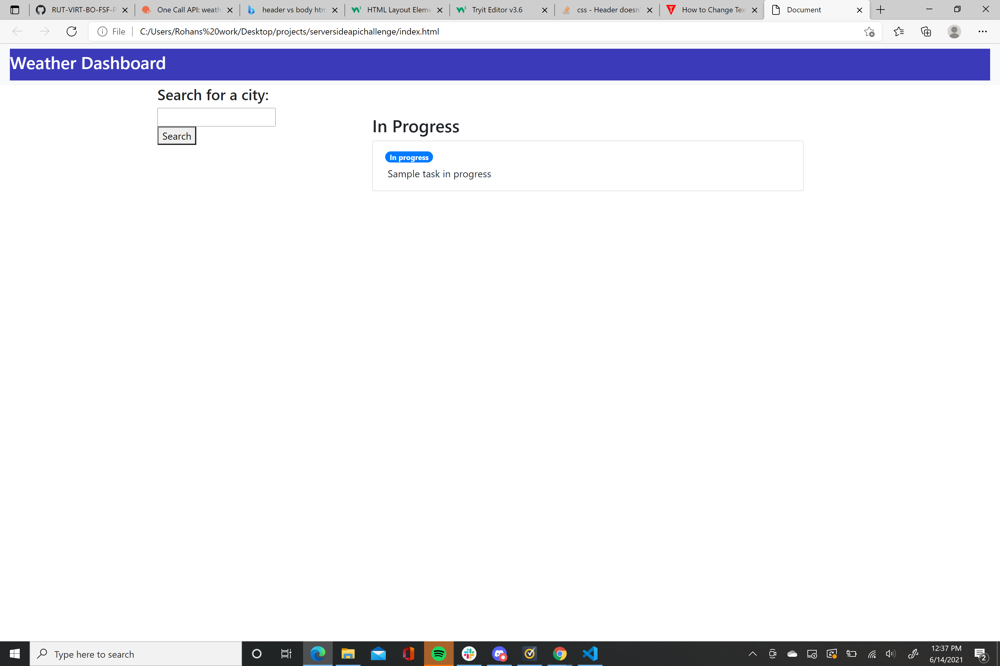
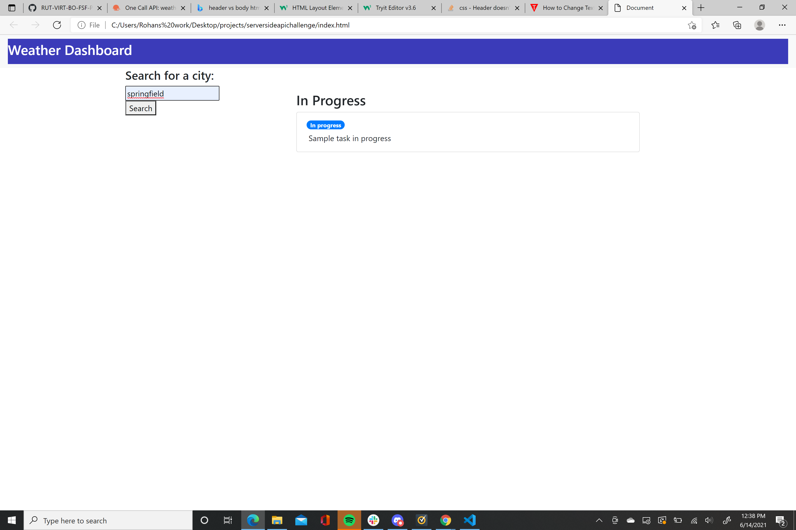
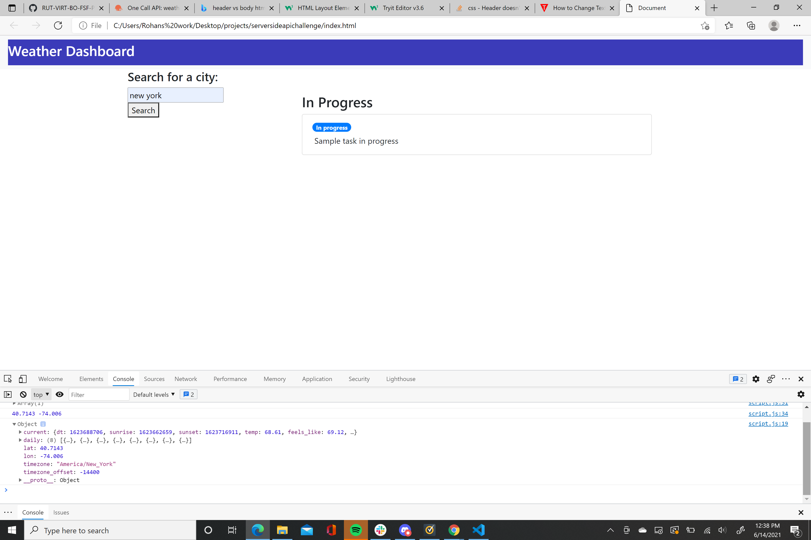

# serversideapichallenge

We were tasked with creating a weather dashboard that would allow users to search for a city and be presented with various weather conditions for that particular city. Those conditions include such things as temperature, UV index , Wind and humidity as well as future weather conditions for that particular city.

Successes-
Was able to create a search bar where users can enter cities
Webpage has stored data on what cities were searched for in the past by user
Used Openweather Api to retrieve information
If user goes on console page they will be able to find temperature results for various times for city that was searched

In progress-
Need to have results appear on page rather than just console
Need to display UV information and humidty

I have also provided screen shots of the webpage in various stages of use.

