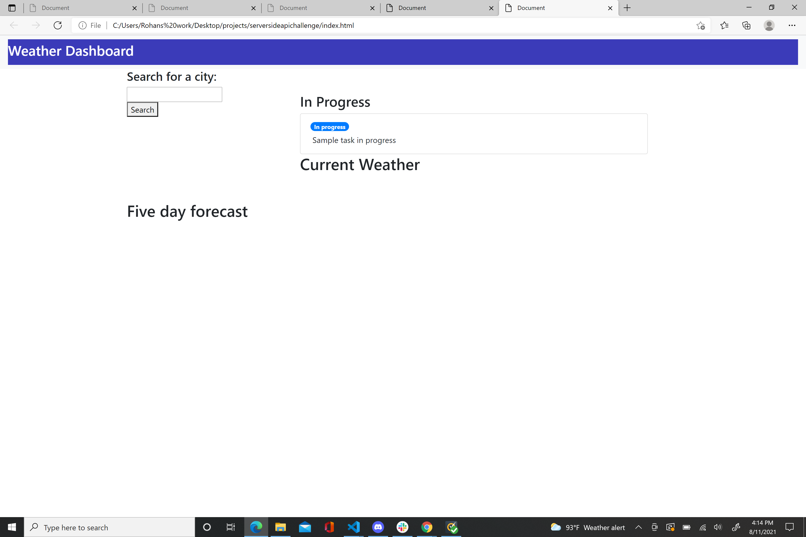
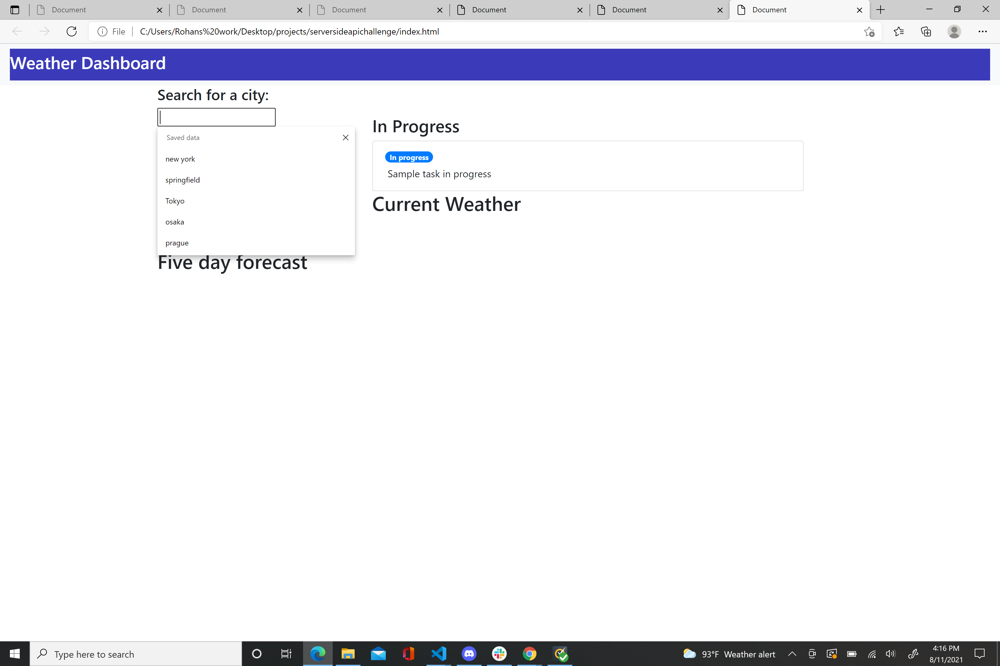
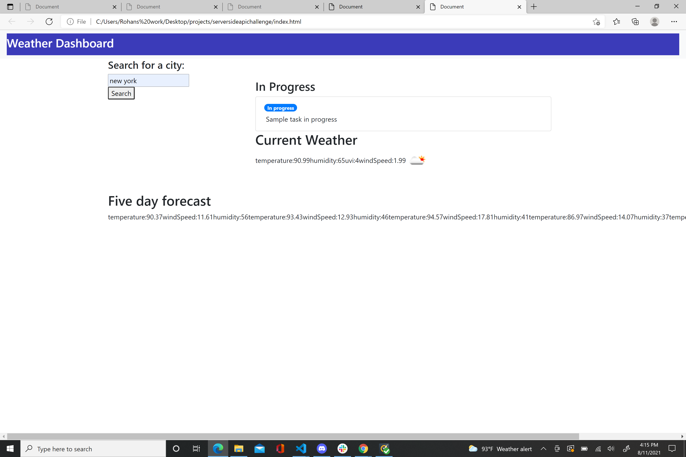

# serversideapichallenge

We were tasked with creating a weather dashboard that would allow users to search for a city and be presented with various weather conditions for that particular city. Those conditions include such things as temperature, UV index , Wind and humidity as well as future weather conditions for that particular city.

Successes-
Was able to create a search bar where users can enter cities
Webpage has stored data on what cities were searched for in the past by user
Used Openweather Api to retrieve information
Can retrive weather results for city entered
Shows image icon of weather of city entered

In progress-
Need  to have previous search results visible on page, in addition to appearing on search bar
Need to have icons and individual cards of five day forecast of city that was entered

I have also provided screen shots of the webpage in various stages of use.

